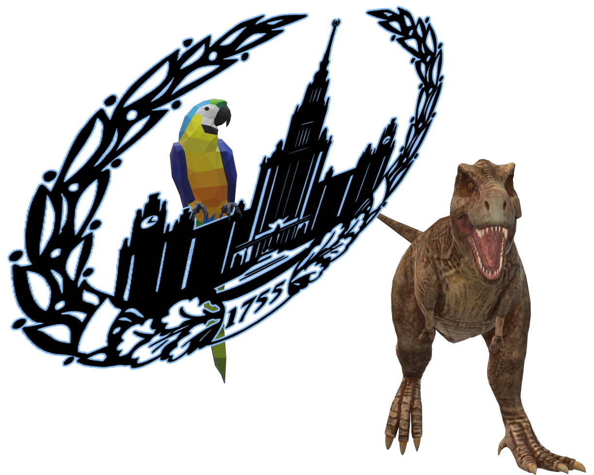

#

     
     
     
    

### **Pythondevelopment АРИЯ АРИЕВИЧА!** - Faculty of Computational Mathematics and Cybernetics
 Репозиторий для изучения совмесной разработки Python3. Тут вы найдете решения задач к лекциям 2022 (6 семестра) группы 321 кафедры АСВК.

#
### Страница Курса: http://uneex.ru/LecturesCMC/PythonDevelopment2022